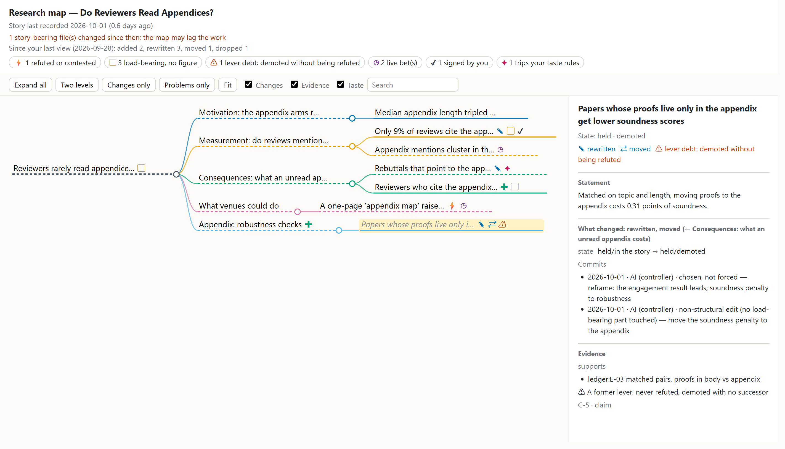
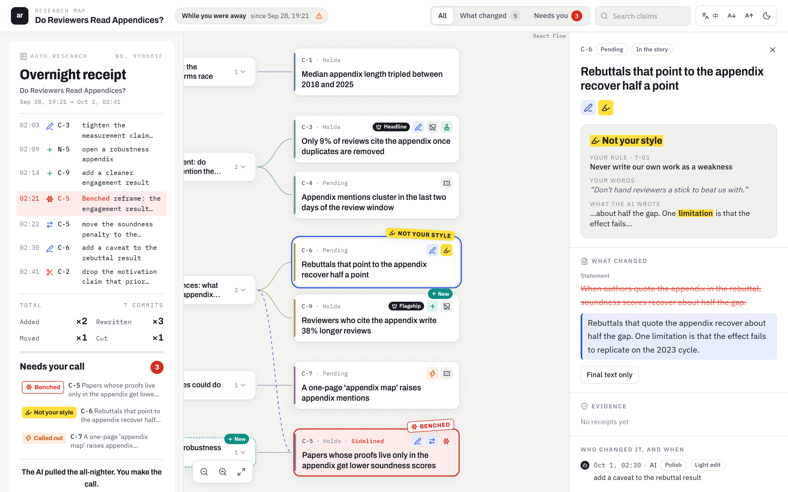

<div align="center">

# auto-research is all you need!

### Your AI pulled an all-nighter on your paper. Here's the receipt.

A research operating system for **Claude Code** and **Codex**, built around the two questions
every AI-assisted researcher ends up asking:

**What did the AI actually do?** &nbsp;·&nbsp; **Is it still my research?**

[](LICENSE)
[](#quickstart)
[](#quickstart)
[](#by-the-numbers)
[](#by-the-numbers)

[**Live demo**](https://ygglc123.github.io/auto-research-is-all-you-need/demo/research-map.html) · [Quickstart](#quickstart) · [中文说明](README_zh.md)

</div>

---

In 2017, attention was all you needed. In 2026, your AI agent has attention to spare. Before
your coffee is ready it has rerun twelve experiments, redrawn every figure, and rewritten your
abstract three times.

Nobody hands you the morning-after report. Which claims moved? Which ones quietly lost their
evidence? Does the paper still argue what *you* set out to argue, or what the model found
easiest to defend at 3 a.m.?

**auto-research is that report, plus the machinery that keeps it honest.** Let the agent run as
far as you like. Every change to your paper's story is recorded, classified and checked against
your own standards, and the big changes need your signature.

<p align="center"></p>

<p align="center"><sub>The bundled demo project, the morning after. Overnight the AI added a claim and an appendix section,
rewrote three claims, moved one and dropped one (the reason is recorded). It also took the flagship result, which
nothing had ever refuted, and demoted it to a robustness appendix. The map flags that in red as
<b>lever debt</b>. <a href="https://ygglc123.github.io/auto-research-is-all-you-need/demo/research-map.html">Click around the live page</a>,
or build it yourself with <code>python examples/build_demo.py</code>.</sub></p>

## Two questions, two answers

### 🗺️ "So… what did you do last night?" → the research map

One self-contained HTML page. It shows your paper's argument as a mind map, marked with
everything that changed since **you** last looked:

| mark | meaning |
|:---:|---|
| ✚ ✎ ⇄ | added · rewritten · moved (dropped claims are listed with their reason) |
| ⚡ | refuted or contested by evidence |
| ? | held, but nothing supports it |
| ▢ | load-bearing, but no figure shows it |
| ⚠ | **lever debt**: demoted without ever being refuted |
| ◷ | live bet: still open, with its resolution condition written down |
| ✔ | a decision you signed |
| ✦ | trips one of your taste rules |

Click any node to see the before/after diff, the commit that changed it and who made it, and the
evidence it stands on. There's more:

- **Staleness alarm.** Files that changed after the story was last recorded are counted, so the
  map never pretends to be current.
- **Zero infrastructure.** No server, no account, no network requests. Deep links (`#node=C-5`)
  make it easy to paste a node into a chat.
- **Bring your own mind-map app.** Export to markmap, XMind or Obsidian (JSON Canvas). Rename or
  move nodes there and import the file back. Your edits come back as a *proposed* patch keyed by
  stable ids, and nothing is applied until it's reviewed.
- **Speaks your language.** The page switches between English and Chinese to match your story.

### 👅 "Does the AI have taste?" → no. So it writes yours down.

On Anthropic's [TASTE benchmark](https://alignment.anthropic.com/2026/taste/), the task is to pick
the better of two AI-safety research proposals. The best model matched experienced researchers
60% of the time; the researchers themselves reached 77%. So this plugin doesn't pretend the model
shares your taste. It keeps a **taste ledger** instead.

Say *"Don't hand reviewers a stick to beat us with"* once, and it becomes a rule with your words
attached:

```text
T-01  avoid  "Never write our own work as a weakness"
      source: you, "Don't hand reviewers a stick to beat us with."
      pattern: \blimitations?\b|\bfail(s|ed|ure)?\b|\bwe do not claim\b
```

The next morning, `check` catches what the AI slipped in overnight (real output from the demo,
trimmed):

```json
"story_flags": [{ "rule": "T-01", "node": "C-6", "match": "limitation",
                  "excerpt": "about half the gap. One limitation is that the effect fail" }],
"file_check":  { "flags": [{ "rule": "T-01", "file": "paper/sec3_consequences.tex", "line": 4,
                  "excerpt": "One limitation of our design is that we cannot observe reading time." }] }
```

<p align="center"></p>

- **No quote, no rule.** Every rule carries your own words or a decision you signed. A rule
  nobody stated is the model's taste wearing your name, so the CLI refuses it
  (`RULE_SOURCE_REQUIRED`).
- **Append-only.** Rules are retired with their history kept, never edited. The AI can't
  hand-edit the ledger: a hook blocks direct writes, and rules only go in through the CLI.
- **It learns from your verdicts.** `harvest` turns decisions you already made into candidate
  rules, and you pick the ones to keep.

## …and the rest of the operating system

| | |
|---|---|
| 🌳 **Git for your story** | Your argument lives in a versioned tree (root → sections → claims). Each change is a commit, classified as *refine*, *restructure* or *overthrow*, and marked as either **forced** by evidence or **chosen**. "Forced" needs a counterfactual sentence and your signature; without them the commit is recorded as unknown. Replacing the root claim is refused without your approval (`OVERTHROW_REQUIRES_USER_APPROVAL`). |
| 🧾 **No silent story drift** | A session that touched story-bearing files can't end until the change is accounted for (`CHRONICLE_REQUIRED`). Even "nothing changed" gets a receipt. |
| 🚪 **Verification as a bouncer, not a babysitter** | A fresh-context verifier stands at four doors: irreversible operations, closing a core result that nothing mechanical can recheck, phase exit / snapshot, and submission. It doesn't sit through every step. If a number can be recomputed, it gets **rerun**, not read. Agreement among models counts as correlated evidence, not proof. |
| 🚫 **No silent skips** | Every tool a skill depends on is probed on the current host. A missing tool means a loud fallback, a visible blocker or a hard stop, and silently skipping is a contract violation. |
| 📊 **Figures that can't hallucinate numbers** | Template-first routing: data goes to deterministic matplotlib templates, diagrams are assembled from an index of 2,830 Bioicons with their licenses recorded, and image generation is allowed only for conceptual art. An exact numeric panel never reaches an image model. |
| ⚔️ **Theory siege** | FALSIFY → CONSTRUCT → VERIFY → RED_TEAM → ADJUDICATE, with five honest outcomes: proved, refuted, conditional, barrier, or a smaller equivalent open problem. A verdict on an unfrozen claim is refused by the CLI. |
| 🔁 **An autonomous loop that knows when to stop** | It works in ticks with a stagnation budget. When a gate stays stuck, you get one decision with two options and a recommendation, never an infinite retry or a silent stall. |
| 🧠 **Anti-amnesia** | Project state lives in `.research-os/`, written only through validating CLIs. Session-start and pre-compaction hooks inject a digest, so a context compaction doesn't wipe out where the agent was. |

## What a morning looks like

> **You:** what did you change overnight?
>
> **AI:** Added a claim and an appendix section, rewrote three claims, moved one, dropped one.
> Smith & Lee (2025) had already measured that one, and that's recorded as the reason. One thing needs you: I moved the soundness
> result into the robustness appendix although nothing refuted it. Keep it there, or restore it
> to the main story? I'd restore it.

*(Illustrative. The facts are the demo project's.)* You never learn a command or a format. The
pilot maps whatever you say onto skills, agents and CLIs, and it interrupts only for decisions
that are genuinely yours.

## Quickstart

**Claude Code**

```text
/plugin marketplace add https://github.com/YGGLC123/auto-research-is-all-you-need
/plugin install auto-research@auto-research-is-all-you-need
```

(With a GitHub SSH key, the short form `YGGLC123/auto-research-is-all-you-need` works too.)

Start a new session, run `/auto-research:pilot`, and talk: *"pick up the appendix paper"*,
*"show me the map"*, *"the flagship result stays in the main text"*.

**Codex**

```text
codex plugin marketplace add YGGLC123/auto-research-is-all-you-need
codex plugin add auto-research@auto-research-is-all-you-need
```

**Kick the tires without a project**

```bash
git clone https://github.com/YGGLC123/auto-research-is-all-you-need
cd auto-research-is-all-you-need
python examples/build_demo.py      # a fictional paper + one night of AI edits -> research-map.html
python scripts/run_selftests.py    # every self-test suite, one verdict
```

More detail: [docs/onboarding.md](docs/onboarding.md).

## By the numbers

- **15 skills**, from intake to submission: pilot, bootstrap, discovery, interrogation,
  evidence, theory siege, method, experiments, artifacts, manuscript, narrative, review,
  reproducibility, loop, verify-and-stop.
- **9 agents**: five standing roles that only *propose* while a single CLI does the writing
  (chronicler, theory operator, evidence steward, experiment runner, figure engineer), plus a
  verifier, a refuter, a reproducer and a librarian.
- **19 self-test suites, 850+ checks**, plus package and link checks, all behind one command
  that prints one verdict.
- **Standard-library Python** for the whole control plane. Optional tools (matplotlib, LaTeX,
  Graphviz…) are probed, never assumed.
- **Two hosts** (Claude Code and Codex) sharing the same state on disk.

## What it is not

- **Not a paper mill.** It won't submit anything for you, and it's deliberately loud about
  exactly what a paper mill would hide.
- **Not an "AI scientist" that replaces you.** It's the lab notebook, version control and stern
  co-author you wish your agent shipped with.
- **Not magic.** The verifier can be wrong, and the taste ledger only knows what you've told it.
  The map shows what was *recorded*, and when the record is stale, it says so.

## FAQ

**Is it really all you need?**
No. You also need a research question, data, and coffee. But for knowing what your AI did with
them, yes.

**Will it write my paper?**
It will help draft it. Then it'll make you sign off on every change to the main story, because
that's the whole point.

**Why is some of the documentation in Chinese?**
The project grew up in a bilingual lab. The research map speaks English and Chinese, while some
internal contracts and the narrative-tree page are still Chinese-first. Translation PRs are very
welcome.

**Does it phone home?**
No telemetry. The pages are single files that make no network requests. The CLIs write to your
project's `.research-os/` and a small cross-project index under `~/.claude/auto-research/`. The
only network calls are ones you ask for, such as cloning the Bioicons index or calling your own
Claude CLI for live Q&A.

**Which OS?**
Windows and Linux are tested. The hooks find a Python 3 on their own, so macOS should work too,
and reports are welcome.

## Standing on the shoulders of

The title is borrowed, with apologies, from *Attention Is All You Need* (2017). The claim-audit
and rebuttal rules are adapted from
[ARIS](https://github.com/wanshuiyin/Auto-claude-code-research-in-sleep) (MIT), and the
`verify-and-stop` skill comes from [Caveman](https://github.com/JuliusBrussee/caveman) (MIT). The map exports to
[markmap](https://markmap.js.org/), [JSON Canvas](https://jsoncanvas.org/) and
[XMind](https://xmind.app/), and diagram components come from [Bioicons](https://bioicons.com/).
Details are in [THIRD_PARTY_NOTICES.md](THIRD_PARTY_NOTICES.md), and changes are in
[CHANGELOG.md](CHANGELOG.md).

## License

[MIT](LICENSE). If this plugin ever saves you from a 3 a.m. *"wait, what happened to my main
result?"*, a ⭐ helps the next researcher find it.
