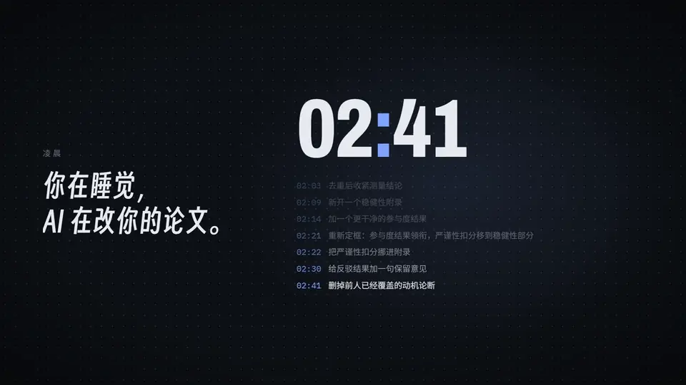
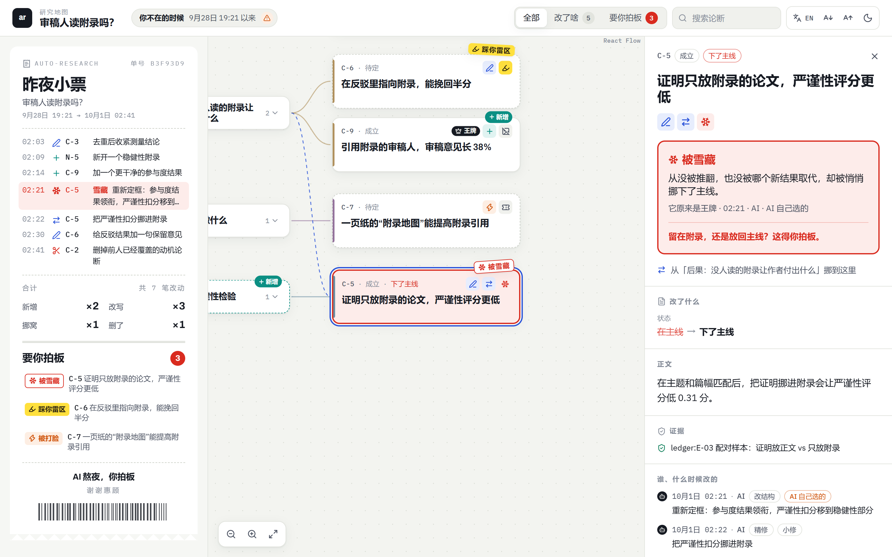
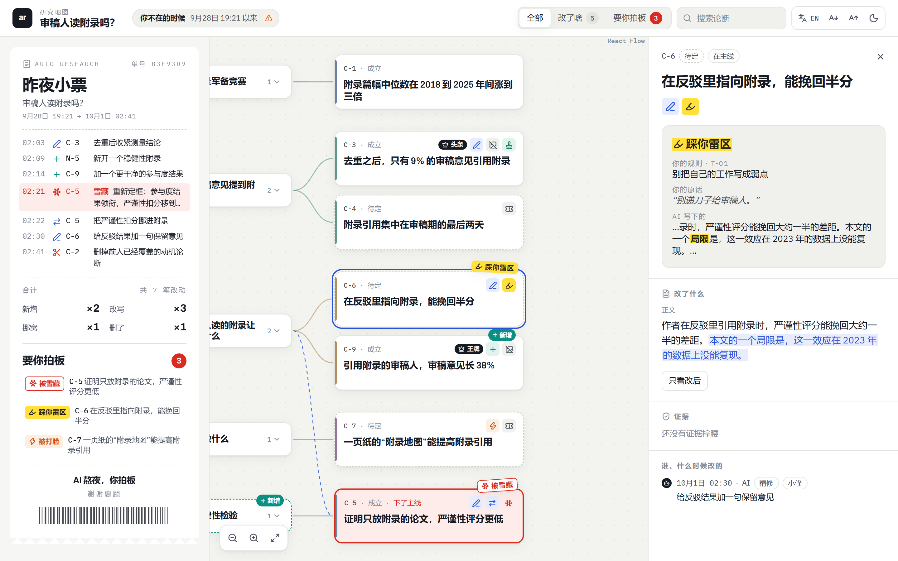

<div align="center">

[English](README.md) · **简体中文**

# auto-research is all you need!

### AI 替你的论文熬了个通宵。小票在这儿。

一个给 **Claude Code** 和 **Codex** 用的开源科研插件，专门回答每个用 AI 做研究的人迟早会问的两个问题：

**AI 到底干了什么？** &nbsp;·&nbsp; **这还是我的研究吗？**

[](LICENSE)
[](#快速上手)
[](#快速上手)
[](#家底)
[](#家底)

[**在线演示**](https://ygglc123.github.io/auto-research-is-all-you-need/demo/research-map-zh.html) · [快速上手](#快速上手) · [English](README.md)

</div>

<p align="center">
  <a href="https://ygglc123.github.io/auto-research-is-all-you-need/assets/promo-zh.mp4">
    
  </a>
</p>

<p align="center"><sub>▶ <a href="https://ygglc123.github.io/auto-research-is-all-you-need/assets/promo-zh.mp4">看 26 秒宣传片</a>（<a href="https://ygglc123.github.io/auto-research-is-all-you-need/assets/promo-en.mp4">English</a>），画面里的都是真界面。
没装 Claude Code 也能先<a href="https://ygglc123.github.io/auto-research-is-all-you-need/demo/research-map-zh.html">在线试玩</a>：不用安装，点开卡片就行。</sub></p>

---

2017 年，Attention is all you need。到了 2026 年，AI 最不缺的就是注意力：你一杯咖啡还没泡好，它已经重跑了十二个实验，重画了所有的图，把摘要改了三遍。

可没人给你一份“第二天早上的交代”：哪些论断挪了位置？哪些悄悄丢了证据？这篇论文论证的，还是你想论证的东西吗？还是凌晨三点模型觉得最好辩护的那个版本？

**auto-research 就是这份交代，外加一套让它说实话的机制。** AI 想跑多远都行，但论文故事的每一处改动都会被记账、归类、对照你的标准检查一遍，大改动必须你签字。

<p align="center"></p>

<p align="center"><sub>自带的演示项目，第二天早上的样子。AI 一夜之间新增了一条论断和一个附录章节，改写了三条论断，挪了一条，删了一条（删的理由有记录）。它还把一个从没被推翻过的王牌结果悄悄挪进了稳健性附录，地图用红色给它盖章：<b>被雪藏</b>。<a href="https://ygglc123.github.io/auto-research-is-all-you-need/demo/research-map-zh.html">打开在线页面点一点</a>，或者自己生成一份：<code>python examples/build_demo.py --lang zh</code>。</sub></p>

## 两个问题，两个答案

### 🗺️ “说吧，你昨晚都干了啥？” → 研究地图

一张自包含的 HTML 页面，把论文的论证画成思维导图，并把**你上次看过之后**发生的一切都标在上面：

| 标记 | 含义 |
|---|---|
| **新增 · 改写 · 挪窝了** | 你上次看过之后改了啥（被删的论断连同理由单独列出） |
| **被打脸** | 被证据推翻，或者证据之间打架 |
| **没证据撑腰** | 还挂着，但没有任何证据支撑 |
| **缺张图** | 承重的论断，却没有图来展示 |
| **被雪藏** | 从没被推翻，也没被哪个新结果取代，却被悄悄挪下了主线（台账里叫 `LEVER_DEBT`） |
| **待开奖** | 还没定论，写明了怎样算开奖 |
| **你拍板的** | 你签过字的决定 |
| **踩你雷区** | 踩了你的口味规则 |

点开任何一张卡片，都能看到改动前后的红笔对比、是哪次提交由谁改的，以及它靠哪些证据站着。另外：

- **昨夜小票**：你上次看过之后的每一笔提交，打成一张小票。把结果雪藏的那一笔印成红色，底下“要你拍板”列出等你决定的事。点任意一行，地图就飞到那张卡片。
- **过期警报**：故事上次入账之后又改过哪些文件，页面会数出来，不会假装自己是最新的。
- **零基础设施**：整个页面就是一个约 0.9 MB 的 HTML 文件，用 React、React Flow、Radix、Tailwind 搭好再全部内联。不用服务器，不用账号，不发任何网络请求。支持深链接（`#node=C-5`），一张卡片直接贴进聊天就能定位。
- **用你顺手的导图软件**：导出成 markmap、XMind 或 Obsidian（JSON Canvas），在那边改名、拖动，再导回来。改动按稳定 id 变成一份**提议**补丁，审过之前什么都不会生效。
- **中英双语、深浅两色**：跟着故事的语言显示中文或英文，一键切换；字号和深色模式也是点一下的事。

### 👅 “AI 有品味吗？” → 没有。所以它把你的品味写下来。

Anthropic 的 [TASTE 基准](https://alignment.anthropic.com/2026/taste/)让模型在两份 AI 安全研究提案里挑更好的那份，以资深研究者的偏好为标准答案：最强的模型 Fable 5 与标准答案一致 60%，抛硬币也有 50%；人类研究者约 77%；几乎所有模型都落在随机水平的两个标准差以内。所以这个插件不假装模型懂你的品味，而是给你建一份**口味清单**。

你只要说一次“别递刀子给审稿人”，它就变成一条带着你原话的规则：

```text
T-01  avoid  "Never write our own work as a weakness"
      source: you, "Don't hand reviewers a stick to beat us with."
      pattern: \blimitations?\b|\bfail(s|ed|ure)?\b|\bwe do not claim\b
```

第二天早上，`check` 就把 AI 夜里偷偷塞进去的句子揪出来（演示项目的真实输出，有删节）：

```json
"story_flags": [{ "rule": "T-01", "node": "C-6", "match": "limitation",
                  "excerpt": "about half the gap. One limitation is that the effect fails" }],
"file_check":  { "flags": [{ "rule": "T-01", "file": "paper/sec3_consequences.tex", "line": 4,
                  "excerpt": "One limitation of our design is that we cannot observe reading time." }] }
```

<p align="center"></p>

- **没有原话，就没有规则**：每条规则都必须带着你自己的话，或者一份你签过字的决定。没人说过的规则，其实是模型的品味借了你的名字，命令行会直接拒收（`RULE_SOURCE_REQUIRED`）。
- **只追加，不涂改**：规则可以退役，历史永远保留。AI 没法手改台账，钩子会拦下直接写入，规则只能经命令行进来。
- **从你的裁决里学**：`harvest` 把你已经拍过板的决定整理成候选规则，留哪条由你挑。

## ……以及这套操作系统的其余部分

| | |
|---|---|
| 🌳 **故事的 Git** | 论证存成一棵带版本的树（主论点 → 章节 → 论断）。每次改动都是一次提交，分为*精修*、*重构*、*推翻*三类，并注明是被证据**逼的**还是**自己选的**。要算“被逼的”，得写出反事实的那句话、再由你签字，否则只记作“不确定”。替换主论点，没有你的批准一律拒绝（`OVERTHROW_REQUIRES_USER_APPROVAL`）。 |
| 🧾 **故事不许悄悄漂移** | 这一轮动过承载故事的文件，就必须先交代清楚才能收工（`CHRONICLE_REQUIRED`）。连“什么都没变”也要开一张回执。 |
| 🚪 **核验是门卫，不是保姆** | 全新上下文的核验员只守四道门：不可逆操作前、关闭一个没法机械复核的核心结果时、阶段收尾或打快照时、投稿前。平时不跟着。能重算的数字一律**重跑**，不靠读。几个模型意见一致，也只算相关的证据，不算证明。 |
| 🚫 **不许悄悄跳过** | 每个技能依赖的工具都会在当前宿主上实测探活。缺了要么大声降级，要么挂一个看得见的阻塞，要么直接停下。悄悄跳过算违约。 |
| 📊 **不会编数字的图** | 模板优先的路由：数据走确定性的 matplotlib 模板；示意图从 2,830 个 Bioicons 图标里拼，每个图标的许可证都有记录；AI 生图只用于概念插图。精确的数值面板永远不会交给生图模型。 |
| ⚔️ **定理围攻** | 证伪 → 构造 → 核验 → 红队 → 裁决，只认五种诚实的结局：证明、反驳、附条件成立、撞上已知壁垒、化归为更小的等价开放问题。没冻结的命题，命令行拒绝给它下结论。 |
| 🔁 **知道什么时候该停的自动循环** | 按节拍推进，带停滞预算。某道关卡迟迟过不去时，它会带着两个选项和一个推荐来找你拍板，不会无限重试，也不会闷声卡死。 |
| 🧠 **防失忆** | 项目状态放在 `.research-os/` 里，只能经过带校验的命令行写入。会话开始和上下文压缩前，钩子会注入一份摘要，压缩之后 AI 也不会忘了自己做到哪儿。 |

## 一个早上大概是这样

> **你：** 昨晚你改了啥？
>
> **AI：** 新增一条论断和一个附录章节，改写三条，挪了一条，删了一条（Smith & Lee 2025 已经测过，理由已记录）。有一件事得你定：我把“证明全放附录的论文严谨性评分更低”这个结果挪进了稳健性附录，但它从没被反驳过。是留在附录，还是放回主线？我建议放回去。

*（示意对话，事实来自演示项目。）* 你不用学任何命令或格式。你怎么说，主控就把它映射到对应的技能、代理和命令行上，只有真正该你拍板的事才来打扰你。

## 快速上手

**Claude Code**

```text
/plugin marketplace add https://github.com/YGGLC123/auto-research-is-all-you-need
/plugin install auto-research@auto-research-is-all-you-need
```

（配好了 GitHub SSH 密钥的话，也可以用简写 `YGGLC123/auto-research-is-all-you-need`。）

开一个新会话，运行 `/auto-research:pilot`，然后直接说话：*“接着做附录那篇”*、*“给我看看地图”*、*“旗舰结果留在正文”*。

**Codex**

```text
codex plugin marketplace add YGGLC123/auto-research-is-all-you-need
codex plugin add auto-research@auto-research-is-all-you-need
```

**没有项目也能先试试**

```bash
git clone https://github.com/YGGLC123/auto-research-is-all-you-need
cd auto-research-is-all-you-need
python examples/build_demo.py      # 一篇虚构论文 + AI 改了一夜 -> research-map.html
python scripts/run_selftests.py    # 跑全部自测，给一个总结论
```

更多细节见 [docs/onboarding.md](docs/onboarding.md)。

## 家底

- **15 个技能**，从立项到投稿：pilot、bootstrap、discovery、interrogation、evidence、theory siege、method、experiments、artifacts、manuscript、narrative、review、reproducibility、loop、verify-and-stop。
- **9 个代理**：五个常驻角色只负责**提议**，由同一个命令行负责落笔（史官、理论操作员、证据管家、实验管家、图形工程师）；另有核验员、反驳者、复现者和图书管理员。
- **19 组自测，850 多项检查**，外加包结构和链接检查。一条命令跑完，给一个总结论。
- **整个控制面只用 Python 标准库**。可选工具（matplotlib、LaTeX、Graphviz……）都先探活，从不假定存在。
- **两个宿主**（Claude Code 和 Codex）共用同一份磁盘状态。

## 它不是什么

- **不是论文工厂**：它不会替你投任何稿，而且偏偏把论文工厂最想藏的东西摆在最显眼的位置。
- **不是取代你的“AI 科学家”**：更像你希望自家 AI 出厂就带着的实验记录本、版本控制，外加一位严格的合作者。
- **不是魔法**：核验员也会出错，口味清单只知道你告诉过它的东西。地图展示的是**已入账**的内容，账过期了它会直说。

## 常见问题

**真的 all you need 吗？**
不是。你还需要一个研究问题、一些数据和几杯咖啡。但要搞清楚 AI 拿它们干了什么，这一个就够了。

**它会帮我写论文吗？**
会帮你起草。然后它会让你为主线上的每一处改动签字，这正是重点。

**为什么有些文档是中文？**
这个项目在一个中英双语的实验室里长大。研究地图中英都会说，部分内部契约和叙事树页面目前还是中文优先，非常欢迎提交翻译 PR。

**会偷偷联网吗？**
没有任何遥测。页面是不发网络请求的单文件。命令行只写你项目里的 `.research-os/`，外加 `~/.claude/auto-research/` 下一个小小的跨项目索引。唯一的联网操作都是你主动要求的，比如拉取 Bioicons 索引，或者调用你自己的 Claude 命令行做实时问答。

**支持哪些系统？**
Windows 和 Linux 实测通过。钩子会自己找 Python 3，所以 macOS 应该也没问题，欢迎反馈。

## 站在这些肩膀上

标题向 *Attention Is All You Need*（2017）致歉并致敬。论断审计和反驳回应的规则改编自 [ARIS](https://github.com/wanshuiyin/Auto-claude-code-research-in-sleep)（MIT），`verify-and-stop` 技能来自 [Caveman](https://github.com/JuliusBrussee/caveman)（MIT）。地图可以导出为 [markmap](https://markmap.js.org/)、[JSON Canvas](https://jsoncanvas.org/) 和 [XMind](https://xmind.app/) 格式，示意图组件来自 [Bioicons](https://bioicons.com/)。详见 [THIRD_PARTY_NOTICES.md](THIRD_PARTY_NOTICES.md)，更新记录见 [CHANGELOG.md](CHANGELOG.md)。

## 许可证

[MIT](LICENSE)。如果它哪天把你从凌晨三点的“等等，我的主结果哪去了？”里救了出来，点个 ⭐，让下一位研究者也能找到它。
